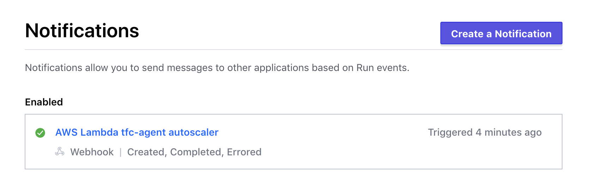

# BigFantech-Cloud

We automate your infrastructure.
You will have full control of your infrastructure, including Infrastructure as Code (IaC).

To hire, email: `bigfantech@yahoo.com`

# Purpose of this code

> Terraform module

Setup Terraform Cloud Agent in ECS FARGATE cluster

## Variables

## Required Providers

| Name                | Description |
| ------------------- | ----------- |
| aws (hashicorp/aws) | >= 4.47     |

### Required Variables

| Name              | Description                                | Type         | Default |
| ----------------- | ------------------------------------------ | ------------ | ------- |
| `tfc_agent_token` | Terraform Cloud Agent Token                | string       |         |
| `aws_region`      | AWS region where the resources are created | string       |         |
| `vpc_id`          | VPC to deploy agent into                   | string       |         |
| `subnet_ids`      | List of Subnet IDs to deploy agent into    | list(string) |         |
|                   |                                            |              |         |
|                   |                                            |              |         |

### Optional Variables

| Name                               | Description                                                                                            | Type                                                                                                     | Default                                                                                 |
| ---------------------------------- | ------------------------------------------------------------------------------------------------------ | -------------------------------------------------------------------------------------------------------- | --------------------------------------------------------------------------------------- |
| `task_cpu`                         | ECS Task CPU units                                                                                     | number                                                                                                   | 2048                                                                                    |
| `task_memory`                      | ECS Task memory (in MiB)                                                                               | number                                                                                                   | 4096                                                                                    |
| `container_cpu`                    | Container CPU units                                                                                    | number                                                                                                   | 1024                                                                                    |
| `container_memory`                 | Container memory (in MiB)                                                                              | number                                                                                                   | 2048                                                                                    |
| `capacity_provider_strategies`     | List of ECS Service Capacity Provider Strategies                                                       | list(object({ &emsp;capacity_provider = string &emsp;weight = number &emsp;base = number })) | [{ &emsp;capacity_provider = "FARGATE" &emsp;weight = 100 &emsp;base = 1 }] |
| `desired_count`                    | Desired number of Terraform Cloud agents to run. Set this lower as desired if using lambda autoscaling | number                                                                                                   | 1                                                                                       |
| `lambda_app_version`               | Version of lambda to deploy                                                                            | string                                                                                                   | 1.0.0                                                                                   |
| `max_tfc_agent_count`              | (autoscalling with Lambda) Maximum number of Terraform Cloud agents to run                             | number                                                                                                   | 2                                                                                       |
| `cloudwatch_log_retention_in_days` | ECS CloudWatch log retention in days                                                                   | number                                                                                                   | 90                                                                                      |

## Autoscaling tfc-agent with a Lambda Function

I've included a Lambda function that, when combined with [Terraform Cloud notifications](https://www.terraform.io/docs/cloud/workspaces/notifications.html), enables autoscaling the number of Terraform Cloud Agents running.

To use it, you'll need to:

1. Configure the `desired_count` and `max_tfc_agent_count` Terraform variables as desired. `desired_count` sets the baseline number of agents to always be running. `max_tfc_agent_count` sets the maximum number of agents allowed to be running at one time.

2. Configure a [generic notification](https://www.terraform.io/docs/cloud/workspaces/notifications.html#creating-a-notification-configuration) on each Terraform Cloud workspace that will be using an agent (workspace [execution mode](https://www.terraform.io/docs/cloud/workspaces/settings.html#execution-mode) set to `Agent`). I've included a helper script that will create them for you, however you can always create and manage these in the Terraform Cloud workspace Settings. You could also use the [Terraform Enterprise provider](https://registry.terraform.io/providers/hashicorp/tfe/latest/docs).

That's it! When a run is queued, Terraform Cloud will send a notification to the Lambda function, increasing the number of running agents. When the run is completed, Terraform Cloud will send another notification to the Lambda function, decreasing the number of running agents.

Note: [Speculative Plans](https://www.terraform.io/docs/cloud/run/index.html#speculative-plans) do not trigger this autoscaling.

### Example config

> Check the `example` folder in this repo

## References

- [Terraform Cloud Agents](https://www.terraform.io/docs/cloud/workspaces/agent.html)
- [Agent Pools and Agents API](https://www.terraform.io/docs/cloud/api/agents.html)
- [Agent Tokens API](https://www.terraform.io/docs/cloud/api/agent-tokens.html)
